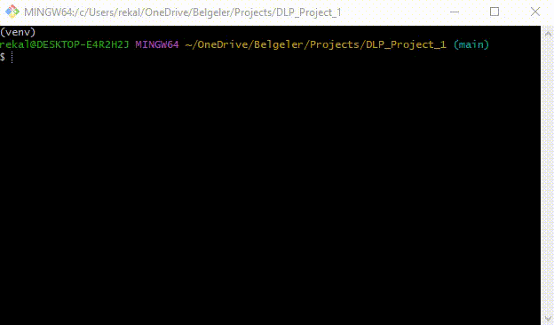

# DLP Data Classification Project



## Overview

This project is designed to classify a dataset based on predefined Data Loss Prevention (DLP) categories. The data is categorized into Sensitive, Confidential, Public, Private, and Critical information.

## Technologies
- Python (Pandas)


## Project Structure

- **your_dataset.csv**: The input dataset to be classified.
- **classify_data.py**: The Python script that performs the classification.
- **classified_data/**: Directory where classified data files are stored.

## How to Run the Project

1. Place your dataset in the `your_dataset.csv` file.
2. Run the `classify_data.py` script:
```bash
   python classify_data.py
```
3. The classified data will be saved in the classified_data/ directory.

## Classification Categories
- Sensitive: PII, PHI, and other highly sensitive data.
- Confidential: Information that requires approval to view.
- Public: Data with no restrictions on viewing.
- Private: Restricted access data, may require an NDA.
- Critical: Data that should always be available.

## License
This project is licensed under the GNU General Public License v2.0. You may obtain a copy of the license in the LICENSE file included in this repository or visit the GNU website for more details.


### Explanation:

1. **License Section**: A `License` section is added at the end of the `README.md`.
2. **Summary of the License**: It briefly explains that the project is licensed under the GNU General Public License v2.0.
3. **Link to the Full License**: It directs users to the `LICENSE` file in the repository or provides a link to the official GNU website where the license can be viewed.

This approach ensures that anyone viewing the `README.md` will understand the licensing terms and know where to find more detailed information.

